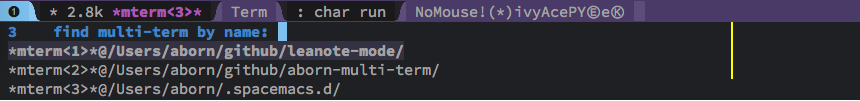

# multi-term-plus
File [multi-term.el](./multi-term.el) fork from [multi-term](https://www.emacswiki.org/emacs/download/multi-term.el). 
And I do some extensions in [multi-term-plus.el](./multi-term-plus.el).

## Why for this?
The [multi-term](https://www.emacswiki.org/emacs/download/multi-term.el)
only provides basic operations in term-mode. And *C-a C-e C-k C-d* do not act as normal 
terminal. So, [multi-term-plus.el](./multi-term-plus.el) implements those features.
What's more, it can recover previous term when emacs reopen and fast switch between terms.

## How to use it?
* Download multi-term-plus files via curl:
```shell
$ sh -c "$(curl -fsSL https://raw.github.com/aborn/multi-term-plus/master/scripts/install.sh)"
```
* Add following code to your emacs init file:
```elisp
(add-to-list 'load-path "~/multi-term-plus")
(require 'multi-term-config)
```
* For detail configuration, please ref [multi-term-config.el](./multi-term-config.el). Modify it as you need.

## Extensions
* Fast term switch when you open multi terms (key binding: **C-{**).  
  
```elisp
multi-term-find
```
* Act as normal terminal using kill-line in term-mode (key binding: **C-k**).  
```elisp
multi-term-kill-line
```
* Auto recover previous term buffers when emacs reopen. Add follow code to your 
emacs init file if you don't need the recovery feature.
```elisp
(setq multi-term-recovery-p nil)
```

English version readme ends here. Chinese readme provided as follows.

--------------------------------------------------------------------------------
# multi-term-plus
multi-term.el这个文件是从[multi-term](https://www.emacswiki.org/emacs/download/multi-term.el)fork而来。
在这个基础上，我自己添加了一些新的功能在[multi-term-plus.el](./multi-term-plus.el)里。

## 为什么要做这个工作？
原生的multi-term.el功能不是很完善，像*C-e C-a C-k C-d*这些功能表现得跟正常的terminal不一样。
所以才有了[multi-term-plus.el](./multi-term-plus.el)这个扩展。它不仅提供了在不同terms里快速
切换的能力，同时当emacs再次启动的时候，也能恢复上一次打开的terminals。

## 如何安装？
* 通过curl的方式下载需要的文件(机器需要安装git)：
```shell
$ sh -c "$(curl -fsSL https://raw.github.com/aborn/multi-term-plus/master/scripts/install.sh)"
```
* 将下列代码添加到你的配置文件中(~/.emacs, ~/.emacs.d/init.el, ~/.spacemacs, ~/.spacemacs.d/init.el)
```elisp
(add-to-list 'load-path "~/multi-term-plus")
(require 'multi-term-config)
```
* 更详细的配置请参考我的配置 [multi-term-config.el](./multi-term-config.el),请按自己需要进行相应修改!

## 功能点
* 快速切换到不同的multi-terms（绑定到**C-{**这个快捷键里）   
  
```elisp
multi-term-find
```
* 智能的kill-line操作，绑定到**C-k**，像在普通的terminal里操作一样  
```elisp
multi-term-kill-line
```
* 再次打开emacs时，会自动恢复上一次的几个multi-term。如果不需要这个功能可以通过设置**multi-term-recovery-p**值为nil来关闭该功能。  
```elisp
(setq multi-term-recovery-p nil)
```

## 详情
更多详情，请参考我写的这篇博客[emacs 使用multi-term](http://www.jianshu.com/p/2c1ac913d2cb)。

